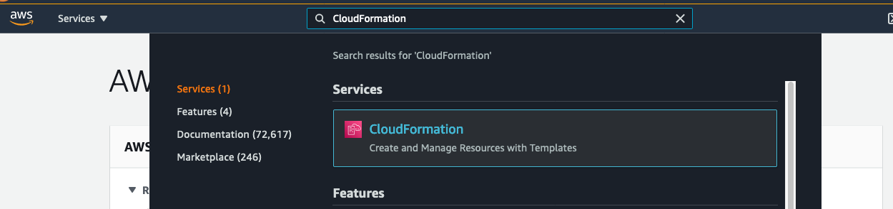
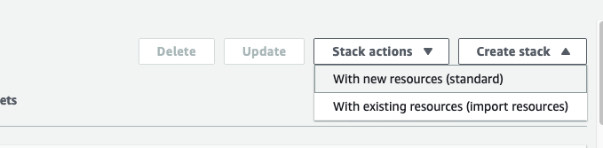
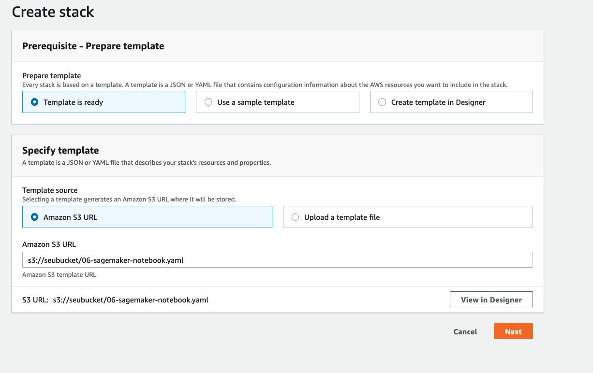
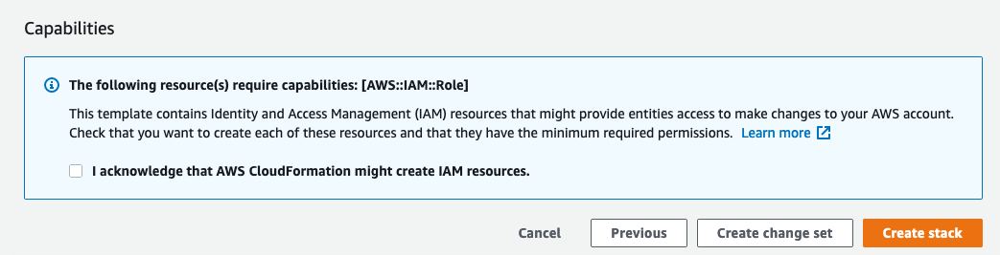

# Como fazer o Deploy dos recursos de Analytics na AWS ?

## AWS CloudFormation

- [Conheça o que é o CloudFormation e seus conceitos básicos:](https://aws.amazon.com/pt/cloudformation/)

## Passo a passo para utilizar o CloudFormation

- Ao logar no console da AWS, procure pelo serviço Cloud Formation: 

- Clique em Stack Options e selecione a opção `with new resources`

- Na opção de `Create Stack`, selecione a opção `upload template file` e `Choose file` , encontre o arquivo na sua máquina (após baixar aqui do Github :p ) 

- Na Stack Name, pode escolher o nome da sua Stack, por exemplo `sagemaker-notebook-avangers`

- Preencha os campos com as variaveis necessárias, e clique em `Create Stack`

# Templates Disponiveis

Os recursos são disponiveis para provisionamento utilizando CloudFormation, esses templates são previamente configurados para provisionar os recursos em sua conta AWS de forma mais simples.

Templates disponíveis para a batalha de dados: 

- **SageMaker Notebook:** Esse template provisiona um Notebook para ser utilizado na AWS.

> Jupyter Notebook é uma aplicação web que permite a você criar e compartilhar documentos que contem ao mesmo tempo código interativo e textos explicativos.
