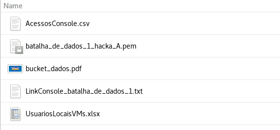
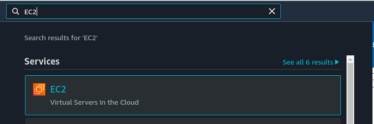
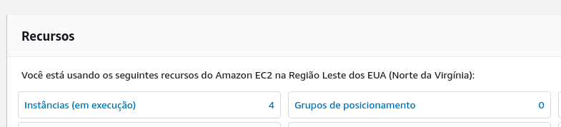
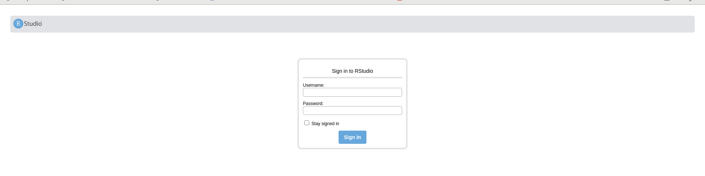

# Kit de Acesso dos participantes

Cada hacka recebeu um arquivo `batalha_de_dados_X_hacka_Y.zip` (X é um número de 1 a 9, indicando o número da conta e Y representa a equipe com letra 'A' ou 'B' para a equipe). Esse arquivo compactado contém 5 arquivos:

- **AcessosConsole.csv:** Um arquivo em formato `csv`, delimitado por vírgulas, com informações relacionadas aos usuários IAM para acesso ao console AWS, juntamento com as credenciais de `accessKey` e `secretKey`;

- **batalha_de_dados_X_hacka_Y.pem:** *Key pair* para acesso ssh à instância *Thanos* (Unix) com privilégios de `admin/root`

- **bucket_dados.pdf:** Um slide com o nome do bucket de dados (batalhasocial-iu) e indicação do diretório para cada Estado.

- **LinkConsole_batalha_de_dados_X.txt:** Arquivo de texto com o link para acesso ao console AWS

- **UsuariosLocaisVMs.xlsx:** Arquivo em formato xlsx com as credenciais de usuário e senha para acesso à instância *Joker* (Windows) e ao R-Studio.

## Acesso ao R-Studio

O acesso a ferramenta `R-Studio` pode ser feito a partir de um navegador, a partir da sua estação de trabalho pessoal ou da VM Windows, a partir do endereço público da máquina Thanos da sua equipe.

- Ao logar no console da AWS, procure pelo serviço EC2: 

- Procure pelo recurso "Instâncias (em execução)": 

- Selecione a máquina Thanos do seu Hacka (A ou B) e copie o endereço descrito em "DNS IPv4 Público" no menu inferior e então acrescente `:` seguido da porta `8787`. Utilize o endereço formado no navegador. Ele deve ficar semelhante a: 

`http://ec2-1-23-456-78.compute-1.amazonaws.com:8787/`

- Você deve visualizar a tela abaixo. Utilize uma das credenciais do arquivo **UsuariosLocaisVMs.xlsx** e pronto :D 

## Acesso ssh à máquina Thanos (Unix) com privilégio root

Para acessar a remotamente a máquina Thanos do seu Hacka, utilize a chave do arquivo `batalha_de_dados_X_hacka_Y.pem` do seu kit de acesso e o endereço de "DNS IPv4 Público" ou "Endereço IPv4 Público" no comando abaixo em um terminal/shell:

`ssh -i batalha_de_dados_X_hacka_Y.pem ec2-user@<endereco_ip_ou_dns>`
